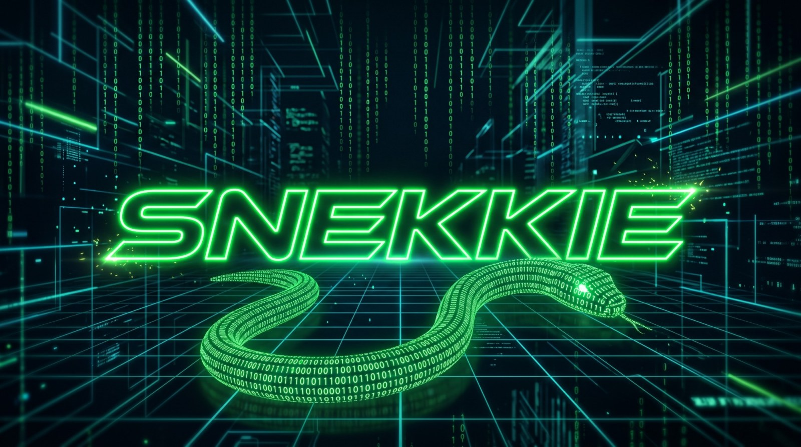
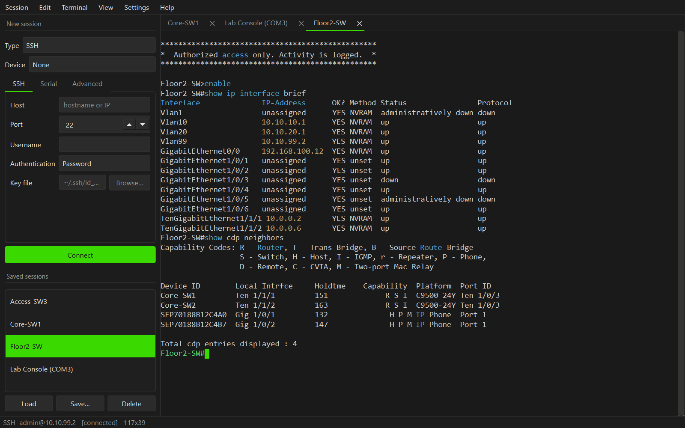
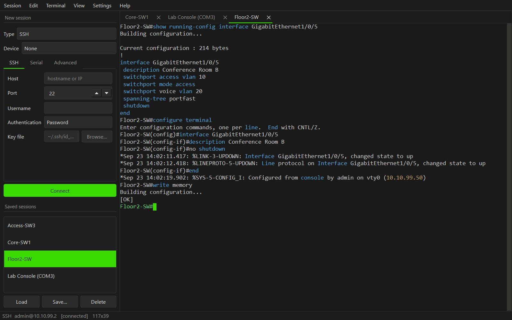
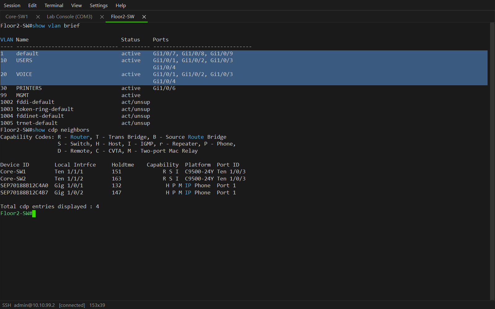

<p align="center">
  
</p>

A clean, tabbed SSH and serial terminal written in Python — a lightweight, readable alternative to PuTTY with automatic COM port detection.

*(Note: Previously called **pyterm**. Existing configs migrate automatically to `%APPDATA%\snekkie` on Windows or `~/.config/snekkie` on Linux).*

---

## Features

- **Integrated Layout:** Permanent sidebar for quick-connect and saved profiles; no popup dialogs.
- **SSH:** Password, private key, and SSH agent (Pageant) auth with `known_hosts` verification.
- **Serial:** Auto-detects COM ports, full baud/parity/stop-bit control, flow control, and Cisco break signals.
- **Tabs & Profiles:** Multi-tab sessions (reconnect, duplicate, drag) and zero-secret JSON profiles.
- **VT100 / Truecolor:** Full 24-bit color, ANSI styles, cursor addressing, and smooth scrollback (works with `htop`, `nano`).
- **Terminal UX:** PuTTY-style copy-on-select / right-click paste, multi-screen drag selection, and raw byte session logging.
- **Syntax Highlighting:** Live keyword, IP, and prompt coloring (e.g., Cisco IOS).

---

## Screenshots

### Checking a switch at a glance

`show ip interface brief` and `show cdp neighbors` on a Catalyst switch, with Cisco IOS highlighting turned on. Keywords, IP addresses, and the prompt are colored so the useful parts of long output stand out. Several sessions stay open in tabs, and saved sessions are one double-click away in the sidebar.



### Configuring an interface

Bringing a port up: check its current config with `show running-config interface`, enter `configure terminal`, run `no shutdown`, then save with `write memory`. The prompt tracks each mode (`#`, `(config)#`, `(config-if)#`), and the switch's link-up messages appear as they arrive.



### Full-width terminal and copy-on-select

Hide the sidebar with **Ctrl+B** to give the terminal the whole window. Dragging over output selects and copies it in one step, PuTTY-style, and right-click pastes.



*Screenshots are from a demo session; the switch output is sample data.*

---

## Download

Ready-to-run builds are on the [Releases page](https://github.com/Dynamitecrown/Snekkie/releases/latest). No Python needed.

- **Windows:** Download `snekkie.exe` and double-click it. It isn't code-signed, so SmartScreen may warn on first launch: choose **More info → Run anyway**.
- **Linux (x86_64):** Download `snekkie-linux-x86_64.tar.gz`, then:
  ```bash
  tar -xzf snekkie-linux-x86_64.tar.gz
  ./snekkie
  ```

---

## Installation & Launch

To run from source instead. Requires **Python 3.10+**.

### Windows

- **Quick run:** Double-click `run-windows.bat` (creates `.venv` and runs).
- **Build standalone `.exe`:** Double-click `build-windows.bat` to generate `dist\snekkie.exe` (no Python needed to run afterwards).
- **Manual setup:**
  ```powershell
  python -m venv .venv
  .venv\Scripts\Activate.ps1   # or use .venv\Scripts\activate.bat in cmd
  pip install -r requirements.txt
  python -m snekkie
  ```

### Linux & macOS

```bash
python3 -m venv .venv
source .venv/bin/activate
pip install -r requirements.txt
python -m snekkie
```

> **Serial Port Permissions:** On Linux, add your user to the dialout group:  
> `sudo usermod -aG dialout $USER` (requires re-login). On Windows, ensure required USB drivers (FTDI, Prolific, Cisco) are installed via Device Manager.

---

## Architecture Overview

```
snekkie/
├── profiles.py        # Saved sessions (JSON)
├── settings.py        # App preferences (themes, fonts)
├── emulation.py       # Terminal state machine (pyte wrapper)
├── transport/         # Byte-stream engines (SSH via paramiko, Serial via pyserial)
└── ui/                # PySide6 widgets, input handling, and terminal renderer
```

- **Clean Decoupling:** `Transport` (I/O) → `Emulation` (Screen buffer) → `UI` (Qt paint engine).
- **Performance Optimized:** Background reader threads emit Qt signals to isolate `pyte`. Rendering is throttled to 25 ms, updates only dirty rows, and uses bit-blit scrolling (`QWidget.scroll()`) to prevent full redraws.
- **GC Tuning:** Early heap freeze on startup avoids multi-millisecond GC stalls across large scrollback buffers.

---

## Extending Snekkie

- **New Transport:** Subclass `Transport` in `transport/`, apply `@register("name", "Label")`, and wire it into `_load()`.
- **Custom Syntax Highlighting:** Add `(regex, category)` tuples to `SYNTAXES` in `ui/highlight.py`.
- **Keybindings:** Modify the key event mapping table in `ui/keys.py`.

---

## Development & Packaging

```bash
# Development setup & testing
pip install -e ".[dev]"
pytest
ruff check snekkie tests

# Build Windows single-file executable
pip install pyinstaller
pyinstaller --noconsole --onefile --name snekkie launcher.py
```

---

## Roadmap / Known Gaps

- Non-blocking connection attempts (moving `transport.connect()` to a background worker).
- X11 and SSH port forwarding.
- In-buffer text search.
- Terminal mouse tracking modes (1000/1002/1006) for interactive CLI apps (`vim`).
- SFTP file transfer tab.

---

## License

Snekkie is free software, licensed under the [GNU General Public License v3.0 or later](LICENSE). You may use, study, share, and modify it; if you distribute a modified version, it must also be released under the GPL with its source code available.
