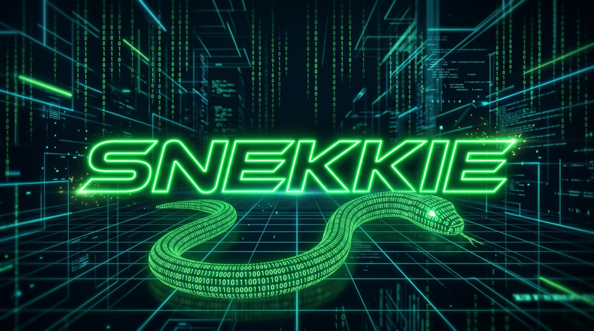
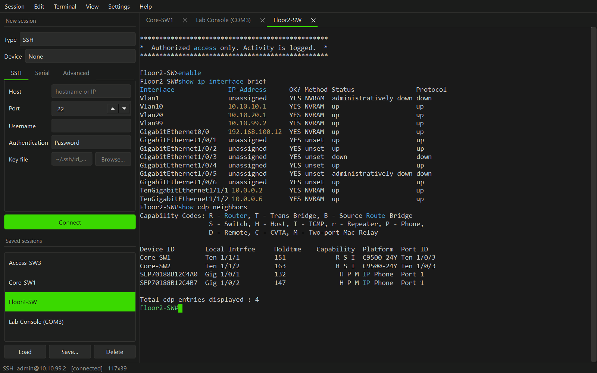
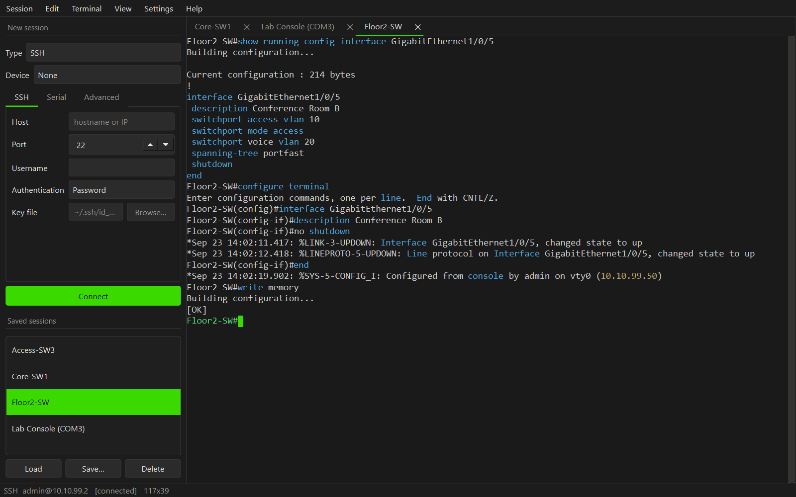
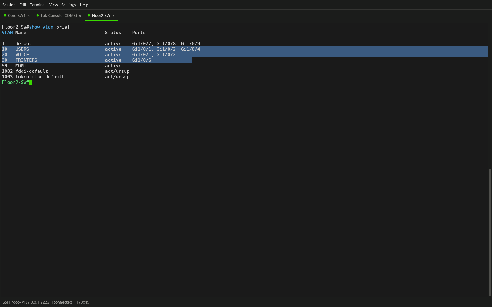

<p align="center">
  
</p>

A clean, tabbed SSH and serial terminal — a lightweight, readable alternative to PuTTY with automatic COM port detection. Built for network engineers who live on console cables and jump between switches all day.

Version 2 is a ground-up rewrite in Rust of the original Python app. It installs with a normal Windows installer, upgrades in place, starts instantly, and needs nothing else on the machine.

**New in 2.4.1:** Fixes for session-tab closing and reused session names, editable theme colours, and a Ctrl+right-click terminal menu with copy, save and append to text file. See the [complete 2.4.1 release notes](docs/releases/2.4.1.md).

Version 2.4.0 introduced optional typing and output animations, automatic paging for all `show` commands, and hover switching between top menus. See the [2.4.0 release notes](docs/releases/2.4.0.md).

---

## Features

- **Integrated layout:** Permanent sidebar for quick-connect and saved sessions; no popup dialogs to get in the way.
- **Menus:** Click a top menu, then hover over Session, Edit, Terminal, View, Settings or Help to switch without another click. Escape or clicking outside closes the menu.
- **SSH:** Password (including keyboard-interactive, as most network gear uses), private key, and SSH agent (Pageant or the Windows OpenSSH agent) auth, with `known_hosts` verification. Older gear that only speaks SHA-1 key exchange, CBC ciphers or `ssh-rsa` host keys still connects; modern algorithms are always preferred.
- **Telnet & raw TCP:** For older gear, lab consoles (GNS3, EVE-NG) and console servers. Telnet negotiates window size and terminal type, and sends break through to the device's console line; raw TCP passes bytes through untouched.
- **Keepalives:** Idle SSH, telnet and raw sessions send a keepalive every 60 seconds (adjustable per session, or off) so firewalls don't drop them, and an SSH session whose server stops answering is closed with a clear reason instead of hanging.
- **Serial:** Auto-detects COM ports and lists them in a drop-down, labelled by adapter serial number so several identical console cables can be told apart. Full baud/data/parity/stop-bit control, flow control, and Cisco break signals.
- **Tabs & profiles:** Multi-tab sessions (reconnect, duplicate, drag to reorder) and zero-secret JSON profiles. Connecting happens in the background, so a slow or dead host never freezes the window.
- **VT100 / truecolor:** Full 24-bit colour, ANSI styles, cursor addressing, and smooth scrollback (works with `htop`, `nano`, `vim`). Terminal emulation is [alacritty_terminal](https://crates.io/crates/alacritty_terminal), the engine inside the Alacritty terminal.
- **Terminal UX:** PuTTY-style copy-on-select / right-click paste, multi-screen drag selection, and raw byte session logging. Per session, local echo (automatic for telnet devices that don't echo) and a Backspace that sends DEL or Ctrl+H for older consoles.
- **Terminal context menu:** **Ctrl+right-click** on terminal output to copy the selection or all output, paste, select all, clear the selection, or scroll to the bottom. Save the selection or all retained output (including scrollback) to a UTF-8 `.txt` file. **Append to text file…** adds the selection (or all output when nothing is selected) to an existing file, with a line break between captures. Plain right-click still pastes.
- **Automatic paging:** Off by default. Enable **Terminal → Auto-page show commands** or the checkbox in **Settings → Preferences** to advance all `show` commands (including `sh`/`sho` and `do show`) at Cisco IOS `--More--` and ASA `<--- More --->` prompts. Sends one Space per page across SSH, serial, telnet and raw TCP; `q`, Ctrl+C or turning the toggle off stops it. The choice is saved and applies to open and new tabs.
- **Syntax highlighting:** Live keyword, IP and prompt colouring (e.g. Cisco IOS).
- **Colour themes:** Start with any preset or saved theme in **Settings → Preferences**, edit its text, background, cursor and selection colours with a live preview, then use **Save as…** to give your custom version a name. **OK** applies and saves your choices; **Cancel** discards edits.
- **Animations:** Off by default. Turn them on in **Settings → Preferences → Animations**, then pick a style for each kind, or Off, while a live preview plays: cursor movement (glide, spring, smear, ghost), cursor blink (fade, pulse, glow), typed characters (pop, bounce, flash, fade), keystroke bursts (sparks, confetti, embers, bubbles, stars, ripple) and screen shake as you type; new text (fade, rise, drop, zoom, decode, heat), typewriter, word or line reveal, scrolling (smooth, float, spring) and new-line marks (glow, flash, marker, underline, shimmer) as output arrives. One speed setting paces everything except the cursor blink. Full-screen apps such as `vim` and `htop` skip the output animations, and output is never held back more than half a second at normal speed (a second at the slowest).
- **Updates:** Checks for a new release each time it starts, and shows **Update to x.y.z** in the menu bar when there is one. One click downloads it, checks it, installs it and restarts Snekkie.

---

## Screenshots

### Checking a switch at a glance

`show ip interface brief` and `show cdp neighbors` on a Catalyst switch, with Cisco IOS highlighting turned on. Keywords, IP addresses and the prompt are coloured so the useful parts of long output stand out. Several sessions stay open in tabs, and saved sessions are one double-click away in the sidebar.



### Configuring an interface

Bringing a port up: check its current config with `show running-config interface`, enter `configure terminal`, run `no shutdown`, then save with `write memory`. The prompt tracks each mode (`#`, `(config)#`, `(config-if)#`), and the switch's link-up messages appear as they arrive.



### Full-width terminal and copy-on-select

Hide the sidebar with **Ctrl+B** to give the terminal the whole window. Dragging over output selects and copies it in one step, PuTTY-style, and right-click pastes.



*Screenshots are from a demo session; the switch output is sample data.*

---

## Download & install

Builds are on the [Releases page](https://github.com/Dynamitecrown/Snekkie/releases).

### Windows (recommended: the installer)

Download `Snekkie-Setup-<version>.exe` and run it.

- **No administrator rights needed.** Snekkie installs for the current user into `%LOCALAPPDATA%\Programs\Snekkie`, with a Start menu shortcut and an entry in *Apps & features*.
- **Updating:** when a new version is out, Snekkie shows **Update to x.y.z** at the right of the menu bar. Click it, then **Update now**: Snekkie downloads the installer, checks it against the release's published SHA-256, and restarts into the new version (asking first if any sessions are connected). Saved sessions and settings are kept. **Help → Check for updates…** checks on demand; the check at startup can be turned off in Preferences. It only ever offers full releases, never pre-releases.
- **Upgrading by hand:** download the newer installer and run it. It finds the existing install, updates it in place, and keeps your saved sessions and settings. If Snekkie is open it asks you to close it first.
- **Uninstalling:** from *Apps & features*. Saved sessions and settings (`%APPDATA%\snekkie`) are left in place, so reinstalling later picks up where you left off.
- **Rolling out to several machines:** the installer runs unattended with `/S`:
  ```
  Snekkie-Setup-2.4.1.exe /S                 install or upgrade silently
  Snekkie-Setup-2.4.1.exe /S /D=C:\Tools\Snekkie   first install into a specific folder
  "%LOCALAPPDATA%\Programs\Snekkie\uninstall.exe" /S
  ```
  A silent upgrade exits with code 5 if Snekkie is running, and refuses to downgrade.

The installer and app aren't code-signed, so SmartScreen may warn the first time: choose **More info → Run anyway**.

Prefer not to install? `snekkie-<version>-portable.exe` is the same program as a single file; run it from anywhere. It tells you when there's a new version and links to the download, but doesn't update itself.

### Linux (x86_64)

Download `snekkie-linux-x86_64.tar.gz`, then:

```bash
tar -xzf snekkie-linux-x86_64.tar.gz
./snekkie
```

> **Serial port permissions:** on Linux, add your user to the dialout group: `sudo usermod -aG dialout $USER` (then log out and back in). On Windows, make sure the USB console cable's driver (FTDI, Prolific, Silicon Labs, Cisco) is installed; the port then shows up in Snekkie's Port list.

### Coming from Snekkie 1.x (the Python version)

- Your saved sessions and settings carry over automatically: 2.x reads the same `%APPDATA%\snekkie` (Windows) or `~/.config/snekkie` (Linux) files.
- The 1.x `snekkie.exe` was a standalone file, so the installer doesn't touch it. Once you're happy with 2.x, delete the old exe and any shortcuts to it.
- Two rarely used serial settings are gone: Mark/Space parity and 1.5 stop bits (the serial driver library doesn't support them). A saved session using one says so when it connects.

---

## Keyboard shortcuts

| Shortcut | Action |
|---|---|
| Ctrl+Shift+N | New session |
| Ctrl+Shift+D | Duplicate the current session |
| Ctrl+Shift+R | Reconnect |
| Ctrl+W | Close tab |
| Ctrl+Q | Quit |
| Ctrl+Tab / Ctrl+Shift+Tab | Next / previous tab |
| Ctrl+Shift+C / Ctrl+Shift+V | Copy / paste (selecting also copies, right-click also pastes) |
| Shift+PgUp / Shift+PgDn | Scroll back through history |
| Ctrl+Shift+L | Clear screen and scrollback |
| Ctrl+Shift+B | Send break (serial and telnet) |
| Ctrl+B | Toggle sidebar |
| Ctrl+, | Preferences |

Every other key goes to the device as usual, including Ctrl+C, Ctrl+V and Ctrl+Shift+6.

---

## Building from source

Requires [Rust](https://rustup.rs) (stable).

```bash
cargo run --release
```

On Windows, `build-windows.bat` builds `target\release\snekkie.exe` and, if [NSIS 3](https://nsis.sourceforge.io) is installed, the installer in `dist\`.

### Releasing a new version

1. Bump `version` in `Cargo.toml`, refresh `Cargo.lock` with Cargo, and write the complete release notes in `docs/releases/<version>.md`.
2. Commit the changes, then tag and push them:
   ```bash
   git tag -a v2.4.1 -m "Snekkie 2.4.1"
   git push --atomic origin main v2.4.1
   ```

CI then tests everything, builds the Windows installer, portable exe and Linux tarball, and publishes them as a GitHub release with the version's release notes. If no notes file exists, it uses GitHub's generated notes. It refuses to build a tag that doesn't match `Cargo.toml`, so an installer can never report the wrong version. A tag with a suffix, such as `v2.1.0-beta.1`, is published as a pre-release, which is handy for trying a build with one user before everyone gets it.

Once a full release is published, every copy of Snekkie offers it the next time it starts. The in-app update looks for the installer by its name, `Snekkie-Setup-<version>.exe`, so keep that name.

---

## Architecture overview

```
src/
├── main.rs            # Window setup; startup error reporting on Windows
├── config.rs          # Where files live, legacy config migration
├── profiles.rs        # Saved sessions (sessions.json)
├── settings.rs        # App preferences and colour themes (settings.json)
├── update.rs          # Checking GitHub for a new release; downloading and running its installer
├── session.rs         # One tab: transport + emulator + log file
├── transport/         # Byte-stream engines: SSH (russh), serial (serialport)
├── terminal/          # Emulation (alacritty_terminal), colours, keys, highlighting
└── ui/                # egui front end: sidebar, tabs, terminal view, dialogs
installer/snekkie.nsi  # Windows installer (NSIS)
```

- **Clean decoupling:** `Transport` (I/O) → `Emulator` (screen buffer) → `ui` (drawing). A transport only moves bytes; it knows nothing about screens.
- **Off the UI thread:** each transport runs in the background and feeds its session's emulator directly, so a large `show tech` is parsed without stalling the window, and output keeps being logged while it's minimised.
- **Drawing:** egui on wgpu, which uses DirectX 12 on Windows and Vulkan or OpenGL elsewhere. If there's no usable GPU (Remote Desktop sessions, VMs), it falls back to the platform's software renderer instead of failing.

---

## Extending Snekkie

- **New transport:** add a module in `src/transport/` with a `start` function that runs a worker, takes `Command`s and reports through a `Sink`, then add it to `Session::connect`.
- **Custom syntax highlighting:** add `(regex, category)` rules in `src/terminal/highlight.rs` and a label to `SYNTAX_LABELS`.
- **Keybindings:** key-to-byte translation is in `src/terminal/keys.rs`; app shortcuts are in `SnekkieApp::shortcuts`.

---

## Development

```bash
cargo test                                     # unit, serial (pty), SSH and UI tests
cargo clippy --all-targets -- -D warnings
cargo fmt
SNEKKIE_SSHD_TESTS=1 cargo test --test ssh     # also test against a real OpenSSH server
```

The serial tests drive a real pty pair, the SSH tests run an in-process SSH server (and optionally a real `sshd`), and the UI tests drive the actual app headlessly with fake serial ports.

---

## Roadmap / known gaps

- In-buffer text search.
- Terminal mouse tracking modes (1000/1002/1006) for mouse-driven CLI apps.
- X11 and SSH port forwarding.
- SFTP file transfer tab.
- Code signing for the installer and exe.

---

## License

Snekkie is free software, licensed under the [GNU General Public License v3.0 or later](LICENSE). You may use, study, share and modify it; if you distribute a modified version, it must also be released under the GPL with its source code available.
