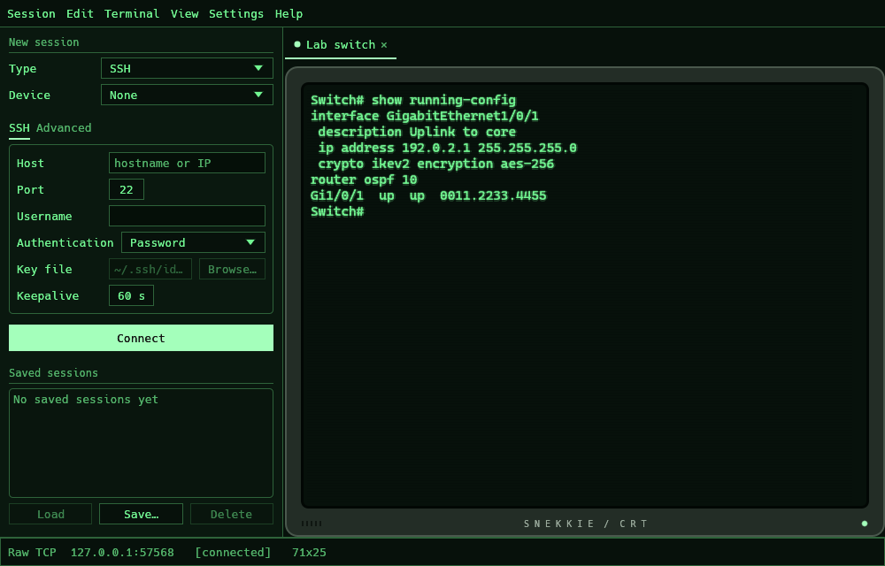
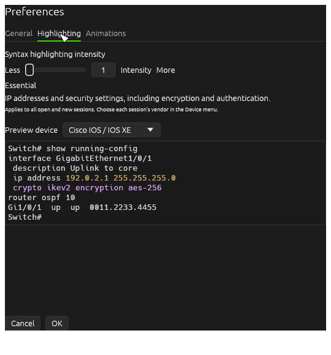
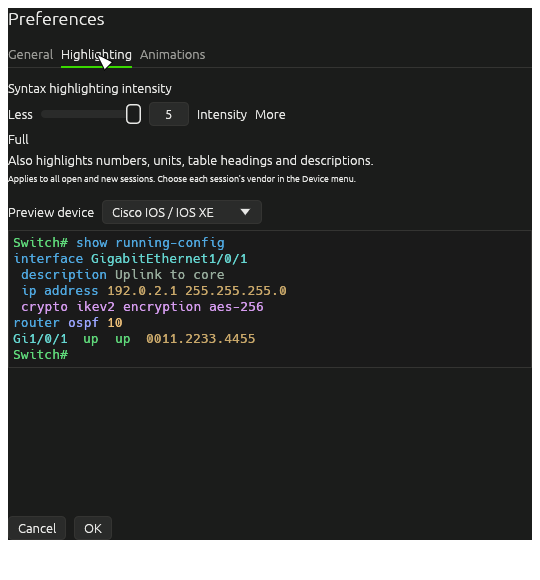

<p align="center">
  
</p>

A tabbed SSH, Telnet, raw TCP and serial terminal for network engineers. Connect to switches, routers, firewalls and console servers from one window, with automatic COM port detection, saved profiles and readable device output.

Snekkie is built in Rust and runs on Windows and Linux. The Windows installer works without administrator rights, keeps your sessions and preferences during upgrades, and supports updates from inside the application.

**New in 2.5.0:** Terminal text search, full app themes including E-Ink Super, expanded animations, network privacy controls, PuTTY session import, saved-session filtering and favorites, persistent profile tab colors, JSON profile import/export, logging status, highlighting intensity controls, additional device platforms and more export formats. See the [feature guide](docs/new-features.md) and [2.5.0 release notes](docs/releases/2.5.0.md). Download [Snekkie 2.5.0](https://github.com/Dynamitecrown/Snekkie/releases/tag/v2.5.0).

---

## Features

- **Integrated layout:** A sidebar for quick connections and saved sessions, with connected devices in tabs. Hide the sidebar with **Ctrl+B** when you need more terminal space.
- **Menus:** Click a top menu, then hover over Session, Edit, Terminal, View, Settings or Help to switch without another click. Escape or clicking outside closes the menu.
- **SSH:** Password (including keyboard-interactive, as most network gear uses), private key, and SSH agent (Pageant or the Windows OpenSSH agent) auth, with `known_hosts` verification. Older gear that only speaks SHA-1 key exchange, CBC ciphers or `ssh-rsa` host keys still connects; modern algorithms are always preferred.
- **Telnet & raw TCP:** For older gear, lab consoles (GNS3, EVE-NG) and console servers. Telnet negotiates window size and terminal type, and sends break through to the device's console line; raw TCP passes bytes through untouched.
- **Keepalives:** Idle SSH, telnet and raw sessions send a keepalive every 60 seconds (adjustable per session, or off) so firewalls don't drop them, and an SSH session whose server stops answering is closed with a clear reason instead of hanging.
- **Serial:** Auto-detects COM ports and lists them in a drop-down, labelled by adapter serial number so several identical console cables can be told apart. Full baud/data/parity/stop-bit control, flow control, and Cisco break signals.
- **Tabs & profiles:** Multi-tab sessions (reconnect, duplicate, drag to reorder) and zero-secret JSON profiles. Connecting happens in the background, so a slow or dead host never freezes the window.
- **Saved-session search & favorites:** Filter the sidebar by session name, hostname/IP, serial device or protocol. Use the clear button to show every session again. Star profiles and enable **Favorites only** to narrow the list; favorites survive restart.
- **VT100 / truecolor:** Full 24-bit color, ANSI styles, cursor addressing, and smooth scrollback (works with `htop`, `nano`, `vim`). Terminal emulation is [alacritty_terminal](https://crates.io/crates/alacritty_terminal), the engine inside the Alacritty terminal.
- **Terminal UX:** PuTTY-style copy-on-select / right-click paste, multi-screen drag selection, and raw byte session logging. Per session, local echo (automatic for telnet devices that don't echo) and a Backspace that sends DEL or Ctrl+H for older consoles.
- **Terminal context menu:** **Ctrl+right-click** on terminal output to copy the selection or all output, paste, select all, clear the selection, or scroll to the bottom. Save the selection or all retained output (including scrollback) as UTF-8 text, choosing **Plain text (.txt)**, **Cisco configuration (.cisco)**, **Markdown (.md)**, **Configuration (.cfg, .conf)**, **Log (.log)** or **All files** for any extension you type. **Append to text file…** supports the same file types and adds the selection (or all output when nothing is selected) to an existing file, with a line break between captures. Plain right-click still pastes.
- **Find in terminal:** **Ctrl+F** or **Edit → Find…** searches the current tab's screen and scrollback. Use literal text, **Match case** or **Regular expression**. **Enter** moves toward older output; **Shift+Enter** moves toward newer output, wrapping at either end. Matches are highlighted and counted as output arrives. **Escape** closes search and returns focus for typing. Each tab keeps its own query and options. See the [search guide](docs/new-features.md#find-in-terminal-output).
- **Automatic paging:** Off by default. Enable **Terminal → Auto-page show commands** or the checkbox in **Settings → Preferences** to advance all `show` commands (including `sh`/`sho` and `do show`) at Cisco IOS `--More--` and ASA `<--- More --->` prompts. Sends one Space per page across SSH, serial, telnet and raw TCP; `q`, Ctrl+C or turning the toggle off stops it. The choice is saved and applies to open and new tabs.
- **Syntax highlighting:** Choose **Cisco IOS / IOS XE**, **Cisco NX-OS**, **Cisco ASA**, **Juniper Junos**, **Aruba AOS-CX**, **Arista EOS**, **Fortinet FortiOS** or **Palo Alto PAN-OS** in the session's **Device** menu. **Settings → Preferences → Highlighting** has an app-wide intensity slider and a live preview for each platform. The five levels progress from IP addresses and security settings to status, commands, interfaces, configuration details, MAC addresses, numbers and descriptions. The default is level 3; **None** disables highlighting for a session. Applying a new intensity recolors existing output in every open session. See the [highlighting guide](docs/syntax-highlighting.md).
- **Color themes:** Choose from 18 presets in **Settings → Preferences**, including **Monochrome Green**, **CRT**, **CRT Super**, **E-Ink Super**, **Blueprint Super**, **Amber Super**, **Amber Terminal**, **Midnight Blue**, **Ocean**, **Purple Haze**, **Soft Grey** and **Paper Light**. Monochrome Green, CRT, all four Super themes, Amber Terminal and Paper Light use their theme colors for all output. CRT adds soft text glow and subtle scanlines inside the terminal, even with animations off. **CRT Super** also gives the program green menus, square controls, a monospace interface and a recessed monitor frame around the terminal, with a power light and ventilation slots. Edit any preset or saved theme's text, background, cursor and selection colors with a live preview, toggle **Monochrome output** and **CRT glow and scanlines**, select an **App appearance**, then use **Save as…** to name your custom version. E-Ink Super gives the whole app a matte reader appearance, Blueprint Super adds blue drafting controls and a fine grid, and Amber Super creates an amber workstation. Colors, effects and app appearances are saved together. **OK** applies and saves your choices; **Cancel** discards edits.
- **Animations:** Off by default. Turn them on in **Settings → Preferences → Animations**, then pick a style for each kind, or Off, while a live preview plays: cursor movement (glide, spring, smear, ghost), cursor blink (fade, pulse, glow), typed characters (pop, bounce, flash, fade, stamp, laser), keystroke bursts (sparks, confetti, embers, bubbles, stars, ripple, explosion, lasers, lightning, portal) and screen shake as you type; new text (fade, rise, drop, zoom, decode, heat, hologram, binary decode), typewriter, word or line reveal, scrolling (smooth, float, spring) and new-line marks (glow, flash, marker, underline, shimmer, laser sweep, radar pulse) as output arrives. One speed setting paces everything except the cursor blink. Full-screen apps such as `vim` and `htop` skip the output animations, and output is never held back more than half a second at normal speed (a second at the slowest).
- **PuTTY import:** **Settings → Import → PuTTY sessions…** previews saved Windows PuTTY sessions or a `.reg` export. Select what to import; supported SSH, Telnet, raw TCP and serial profiles appear in the sidebar. Existing names are kept and conflicts get a suffix. Import never connects automatically; `.ppk` keys and unsupported dependencies are explained in the preview.
- **Profile import & export:** **Settings → Import → Snekkie profiles (.json)…** and **Settings → Export profiles…** preview selected profiles before importing or saving a JSON file. The **…** menu beside the sidebar's Load, Save and Delete buttons opens the same workflows. Existing profiles are preserved; conflicting names get an `Imported` suffix. Key and log file paths are included as references; passwords, key contents and host-key trust are excluded. Import never opens a connection.
- **Session tab colors:** Right-click a saved session → **Default tab color…** to save a color for future tabs. Right-click an open tab → **Tab color** to apply a temporary preset/custom color, **Clear tab color** for the standard appearance, or **Use profile color** to restore the saved default. **Save tab color as profile default** saves the current choice. Colors follow reordering and reconnecting.
- **Logging status:** The status bar shows **Logging**, **Logging off** or **Logging failed** for the current tab, with **Open log folder** when a log path is configured. A write/flush failure warns once and stops the failed log while the terminal and connection continue. Reconnecting retries logging.
- **Network privacy:** The Windows installer and Preferences can disable startup update checks or enable **Offline mode**. Offline mode disables online update checks/downloads and asks before DNS and each connection outside private/local IP ranges. Serial and local IP connections remain available. The choice survives upgrades and can be changed later in Preferences. See the [privacy, import and theme guide](docs/new-features.md).
- **Updates:** Checks for a new release each time it starts, and shows **Update to x.y.z** in the menu bar when there is one. One click downloads it, checks it, installs it and restarts Snekkie.

---

## Screenshots

### CRT Super and custom themes

CRT Super changes the menus, sidebar and controls to a green monospace interface. The terminal sits inside a recessed monitor frame with static glow, scanlines, a power light and ventilation slots. Regular CRT keeps the normal application interface. Both effects work with animations off, and custom themes can save the colors and appearance together.



### Choose how much output is highlighted

The app-wide slider in **Settings → Preferences → Highlighting** progresses from **Essential** to **Full**. The minimum focuses on addresses and security settings; higher levels bring out commands, interfaces, status, protocols, MAC addresses and configuration details. Select a vendor in the preview to compare its sample before applying the setting to live sessions.

<p>
  
  
</p>

### Checking a switch at a glance

`show ip interface brief` and `show cdp neighbors` on a Catalyst switch, with Cisco IOS highlighting turned on. Keywords, IP addresses and the prompt are colored so the useful parts of long output stand out. Several sessions stay open in tabs, and saved sessions are one double-click away in the sidebar.


### Configuring an interface

Bringing a port up: check its current config with `show running-config interface`, enter `configure terminal`, run `no shutdown`, then save with `write memory`. The prompt tracks each mode (`#`, `(config)#`, `(config-if)#`), and the switch's link-up messages appear as they arrive.


### Full-width terminal and copy-on-select

Hide the sidebar with **Ctrl+B** to give the terminal the whole window. Dragging over output selects and copies it in one step, PuTTY-style, and right-click pastes.


*Screenshots use sample device output. The theme and highlighting previews show Snekkie 2.5.0.*

---

## Download & install

Builds are on the [Releases page](https://github.com/Dynamitecrown/Snekkie/releases).

### Windows (recommended: the installer)

Download `Snekkie-Setup-<version>.exe` and run it.

- **No administrator rights needed.** Snekkie installs for the current user into `%LOCALAPPDATA%\Programs\Snekkie`, with a Start menu shortcut and an entry in *Apps & features*.
- **Updating:** when a new version is out, Snekkie shows **Update to x.y.z** at the right of the menu bar. Click it, then **Update now**: Snekkie downloads the installer, checks it against the release's published SHA-256, and restarts into the new version (asking first if any sessions are connected). Saved sessions and settings are kept. **Help → Check for updates…** checks on demand; the check at startup can be turned off in Preferences. It only ever offers full releases, never pre-releases.
- **Upgrading by hand:** download the newer installer and run it. It finds the existing install, updates it in place, and keeps your saved sessions and settings. If Snekkie is open it asks you to close it first.
- **Uninstalling:** from *Apps & features*. Saved sessions and settings (`%APPDATA%\snekkie`) are left in place, so reinstalling later picks up where you left off.
- **Rolling out to several machines:** the installer runs unattended with `/S`:
  ```
  Snekkie-Setup-2.5.0.exe /S                 install or upgrade silently
  Snekkie-Setup-2.5.0.exe /S /D=C:\Tools\Snekkie   first install into a specific folder
  "%LOCALAPPDATA%\Programs\Snekkie\uninstall.exe" /S
  ```
  A silent upgrade exits with code 5 if Snekkie is running, and refuses to downgrade.

The installer and app aren't code-signed, so SmartScreen may warn the first time: choose **More info → Run anyway**.

Prefer not to install? `snekkie-<version>-portable.exe` is the same program as a single file; run it from anywhere. It tells you when there's a new version and links to the download, but doesn't update itself.

### Linux (x86_64)

Download `snekkie-linux-x86_64.tar.gz`, then:

```bash
tar -xzf snekkie-linux-x86_64.tar.gz
./snekkie
```

> **Serial port permissions:** on Linux, add your user to the dialout group: `sudo usermod -aG dialout $USER` (then log out and back in). On Windows, make sure the USB console cable's driver (FTDI, Prolific, Silicon Labs, Cisco) is installed; the port then shows up in Snekkie's Port list.

---

## Keyboard shortcuts

| Shortcut | Action |
|---|---|
| Ctrl+Shift+N | New session |
| Ctrl+Shift+D | Duplicate the current session |
| Ctrl+Shift+R | Reconnect |
| Ctrl+W | Close tab |
| Ctrl+Q | Quit |
| Ctrl+Tab / Ctrl+Shift+Tab | Next / previous tab |
| Ctrl+Shift+C / Ctrl+Shift+V | Copy / paste (selecting also copies, right-click also pastes) |
| Ctrl+F | Find in terminal output; Enter: older match, Shift+Enter: newer match, Escape: close |
| Shift+PgUp / Shift+PgDn | Scroll back through history |
| Ctrl+Shift+L | Clear screen and scrollback |
| Ctrl+Shift+B | Send break (serial and telnet) |
| Ctrl+B | Toggle sidebar |
| Ctrl+, | Preferences |

Every other key goes to the device as usual, including Ctrl+C, Ctrl+V and Ctrl+Shift+6.

---

## Building from source

Requires [Rust](https://rustup.rs) (stable).

```bash
cargo run --release
```

On Windows, `build-windows.bat` builds `target\release\snekkie.exe` and, if [NSIS 3](https://nsis.sourceforge.io) is installed, the installer in `dist\`.

### Releasing a new version

1. Bump `version` in `Cargo.toml`, refresh `Cargo.lock` with Cargo, and write the complete release notes in `docs/releases/<version>.md`.
2. Commit the changes, then tag and push them:
   ```bash
   git tag -a vX.Y.Z -m "Snekkie X.Y.Z"
   git push --atomic origin main vX.Y.Z
   ```

CI then tests everything, builds the Windows installer, portable exe and Linux tarball, and publishes them as a GitHub release with the version's release notes. If no notes file exists, it uses GitHub's generated notes. It refuses to build a tag that doesn't match `Cargo.toml`, so an installer can never report the wrong version. A tag with a suffix, such as `v2.1.0-beta.1`, is published as a pre-release, which is handy for trying a build with one user before everyone gets it.

Once a full release is published, every copy of Snekkie offers it the next time it starts. The in-app update looks for the installer by its name, `Snekkie-Setup-<version>.exe`, so keep that name.

---

## Architecture overview

```
src/
├── main.rs            # Window setup; startup error reporting on Windows
├── config.rs          # Configuration locations and atomic file writes
├── profiles.rs        # Saved sessions (sessions.json)
├── settings.rs        # App preferences and color themes (settings.json)
├── update.rs          # Checking GitHub for a new release; downloading and running its installer
├── session.rs         # One tab: transport + emulator + log file
├── transport/         # SSH (russh), serial (serialport), Telnet and raw TCP
├── terminal/          # Emulation (alacritty_terminal), colors, keys, highlighting
└── ui/                # egui front end: sidebar, tabs, terminal view, dialogs
installer/snekkie.nsi  # Windows installer (NSIS)
```

- **Clean decoupling:** `Transport` (I/O) → `Emulator` (screen buffer) → `ui` (drawing). A transport only moves bytes; it knows nothing about screens.
- **Off the UI thread:** each transport runs in the background and feeds its session's emulator directly, so a large `show tech` is parsed without stalling the window, and output keeps being logged while it's minimised.
- **Drawing:** egui on wgpu, which uses DirectX 12 on Windows and Vulkan or OpenGL elsewhere. If there's no usable GPU (Remote Desktop sessions, VMs), it falls back to the platform's software renderer instead of failing.

---

## Extending Snekkie

- **New transport:** add a module in `src/transport/` with a `start` function that runs a worker, takes `Command`s and reports through a `Sink`, then add it to `Session::connect`.
- **Device highlighting:** add a device's vocabulary, interface pattern and preview sample to `src/terminal/highlight/devices.rs`. The shared matcher, intensity levels and category priorities live in `src/terminal/highlight.rs`; the device registry supplies both pickers automatically. See the [highlighting guide](docs/syntax-highlighting.md).
- **Keybindings:** key-to-byte translation is in `src/terminal/keys.rs`; app shortcuts are in `SnekkieApp::shortcuts`.
- **Terminal search:** matching and bounded scanning live in `src/terminal/search.rs`; the per-tab find bar and result navigation live in `src/ui/search.rs`.

---

## Development

```bash
cargo test                                     # unit, serial (pty), SSH and UI tests
cargo clippy --all-targets -- -D warnings
cargo fmt
cargo run --example find_bar_qa             # render search screenshots into target/terminal-search-qa
SNEKKIE_SSHD_TESTS=1 cargo test --test ssh     # also test against a real OpenSSH server
```

The serial tests drive a real pty pair, the SSH tests run an in-process SSH server (and optionally a real `sshd`), and the UI tests drive the actual app headlessly with fake serial ports.

---

## Roadmap / known gaps

- Terminal mouse tracking modes (1000/1002/1006) for mouse-driven CLI apps.
- X11 and SSH port forwarding.
- SFTP file transfer tab.
- Code signing for the installer and exe.

---

## License

Snekkie is free software, licensed under the [GNU General Public License v3.0 or later](LICENSE). You may use, study, share and modify it; if you distribute a modified version, it must also be released under the GPL with its source code available.
