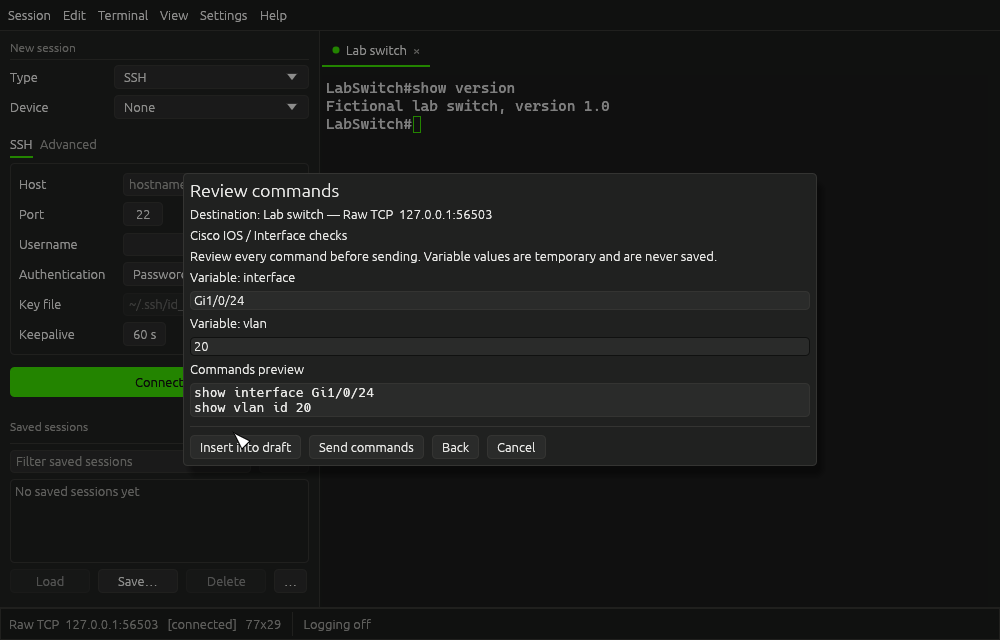

# Saved command snippets

Available in Snekkie 2.6.0. See the [release notes](releases/2.6.0.md) for the complete update.

Open **Edit → Command snippets…** or press **Ctrl+Shift+S**. You can manage the library without a connection. To use a snippet, open the library from the connected tab you want to target; its name, protocol and destination appear above the controls.

## Save a template

Choose **New**, enter a name and an optional vendor or task group, then enter your commands. An empty group appears as **General**. Choose **Save snippet** to save it locally. Select a template to **Edit snippet** or **Delete snippet**; deletion asks for confirmation. Use **Filter snippets** to search names and groups.

Variables use `{{name}}`, for example:

```text
show interface {{interface}}
show vlan id {{vlan}}
```

Names start with an ASCII letter or underscore and contain letters, numbers or underscores. Repeated variables share one value. Use `{{{{` when you need literal `{{` text. Templates are plain command text: there is no scripting engine, shell expansion or automatic credential substitution.

## Review, insert and send

Select a snippet and choose **Use snippet**. Enter its variable values and review **Commands preview** along with the destination. Missing values are listed, and Insert and Send stay disabled until the commands are complete. Values must be a single line without control characters. Values entered here are temporary and never written to the snippet store or exports.



- **Insert into draft** opens an editable local command draft. Inserting, typing and pressing Enter in the draft send no bytes to the device.
- **Send commands** sends the reviewed preview or edited draft to the displayed connection. It uses manual-paste line endings: CRLF and LF become CR, existing CR stays CR, and a final CR is added if needed to submit the last command.
- **Cancel** or Escape closes the preview/draft without sending commands. Closing the library also sends nothing.

The destination stays bound to the tab and connection that opened the library. Changing tab focus cannot redirect commands. If that connection closes or reconnects, Send is disabled; reopen the library on the connected tab and review again. Send returns focus to the destination tab.

Commands use the shared [paste controller](paste-behavior.md) and the saved **Paste delay between lines** (100 ms by default). The status bar shows queued progress and **Stop paste**; Stop, disconnect, reconnect or closing the target discards remaining lines. Set the delay to 0 ms for immediate submission. A queued paste pauses while a dialog is open.

## Local storage and sharing

Templates are saved in `snippets.json` beside `sessions.json`, separately from profiles and preferences. Names must be unique within a group, ignoring case. Editing or moving a template preserves its ID. IDs are local; imported templates receive new IDs.

**Export…** lets you choose templates before saving a version-1 JSON file. The selected library template is preselected; if none is selected, all are checked. **Import…** previews valid templates, skipped-entry notes and collision-safe names before **Import selected** adds them. Existing templates are preserved. Neither import nor export sends commands. Exports cannot overwrite Snekkie's active configuration stores.

Templates and exports contain the command text you save. Keep passwords and other secrets out of templates, and review their contents before sharing. Variables are intended for temporary interface, VLAN and similar command parameters.

Files are limited to 4 MiB and 1,000 templates. A template or expanded draft is limited to 64 KiB, with up to 32 distinct variables. If the local file is damaged or has an unsupported version, Snekkie shows the load error and preserves it rather than overwriting it.
