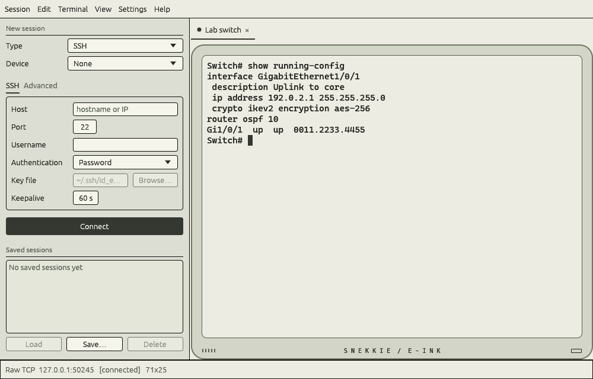
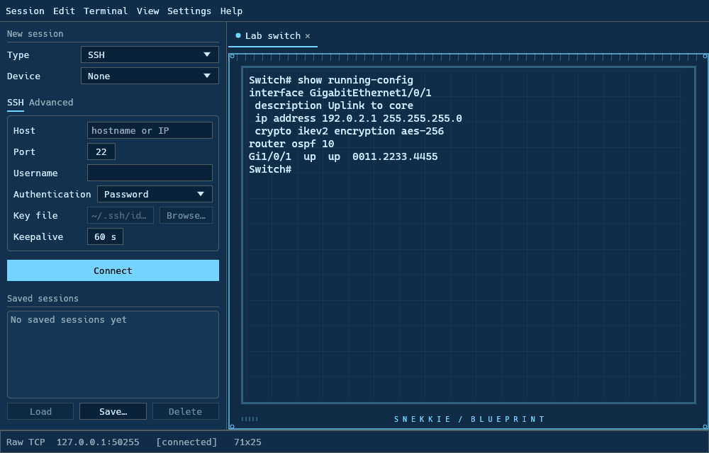
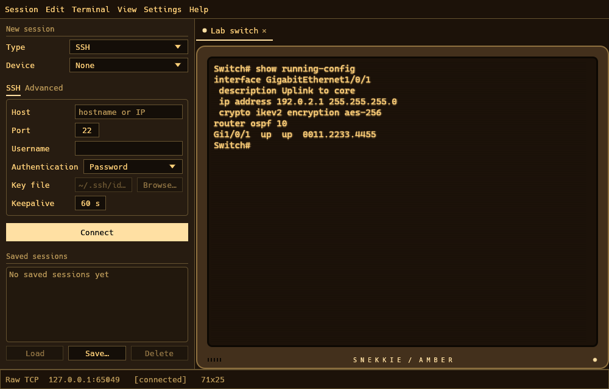
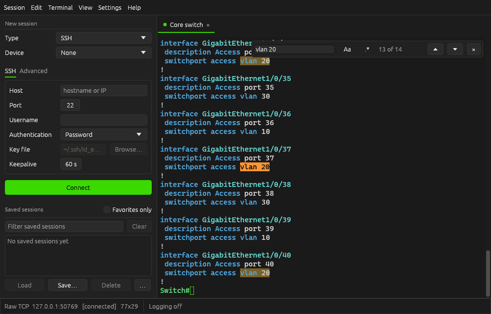

# Snekkie 2.5.0 feature guide

These features are included in Snekkie 2.5.0. See the [release notes](releases/2.5.0.md) for an overview and the [downloads](https://github.com/Dynamitecrown/Snekkie/releases/tag/v2.5.0) for packaged builds.

## Full app themes

Choose a preset in **Settings → Preferences → General**. There are now 18 presets, including four complete app appearances:

| Theme | Appearance |
| --- | --- |
| CRT Super | Green monospace menus and controls, a recessed monitor frame, soft glow, scanlines and a power light |
| E-Ink Super | A matte cream and charcoal interface, crisp monochrome output, rounded reader bezel and a printed status mark; no glow or scanlines |
| Blueprint Super | Blue drafting controls, a fine grid behind the terminal, measurement ticks and a square instrument frame |
| Amber Super | Amber menus, monochrome phosphor text, glow, scanlines and a brown workstation bezel |

All presets remain editable. **Theme colors → App appearance** lets you combine the full app appearance with your own colors. Monochrome output and CRT effects are separate controls. **Save as…** saves colors, appearance and effects together. Changing to a standard theme restores the normal interface. These static effects work with animations off.







## More animation choices

Open **Settings → Preferences → Animations** and enable the master switch. Animations remain off by default. New choices include:

- **Keystroke burst:** Explosion (sparks and a shockwave), Lasers (outward bolts), Lightning (electric arcs) and Portal (a ring with orbiting sparks).
- **Typed characters:** Stamp and Laser.
- **New text:** Hologram and Binary decode.
- **New lines:** Laser sweep and Radar pulse.

Each category can be changed or turned off separately, and the live preview demonstrates the chosen settings. The speed slider applies to the new effects. Particle counts remain capped, effects stay inside the terminal, and finished effects stop requesting frames. Effects only change drawing; transmitted commands, copied text, exports and logs retain the original content.

## Network privacy and installation

The Windows installer now has a **Network privacy** page. You can disable startup update checks by themselves, or select **Enable offline mode** for more limited network use. The same controls are in **Settings → Preferences → General → Network privacy**. Offline mode is optional; existing installations retain their choices during automatic updates.

When offline mode is enabled:

- Startup and manual online update checks, update downloads and the application's release links are disabled.
- Serial, localhost, IPv4 private/loopback/link-local addresses and IPv6 unique-local/loopback/link-local addresses connect directly. IPv4 addresses mapped into IPv6 are classified by their underlying IPv4 address.
- A connection outside those ranges asks for **Allow once** before opening a socket. The dialog identifies the host, IP and port. Each reconnect, duplicate or fallback to a different non-local address asks again; approval is never saved.
- Hostnames ask separately before using the system resolver, because DNS can communicate with external servers. The resulting concrete IP addresses are checked before connection. Use an IP address or `localhost` to avoid DNS resolution.
- Enabling the mode closes current network sessions. Serial sessions remain available. Wait for an in-progress update check/download to finish before changing the mode; its checkbox explains this while an update is busy.
- Turning the mode off does not automatically re-enable startup update checks. Select that checkbox separately if you want them.

The policy limits connections made by Snekkie. Private-address routing, tunnels and system services remain controlled by your network and operating system. A private address is not a guarantee that packets stay physically inside a particular network. The local ranges follow the [IANA IPv4 registry](https://www.iana.org/assignments/iana-ipv4-special-registry/) and [IPv6 unique-local address specification](https://www.rfc-editor.org/rfc/rfc4193.html).

For unattended Windows deployment:

```powershell
Snekkie-Setup-<version>.exe /S /OFFLINE
Snekkie-Setup-<version>.exe /S /NOUPDATES
Snekkie-Setup-<version>.exe /S /ONLINE /NOUPDATES
```

`/OFFLINE` enables the restricted mode and disables updates. `/NOUPDATES` only disables startup checks. `/ONLINE` turns restricted mode off, without changing the saved startup-update preference. With no privacy flags, upgrades preserve the saved policy. `/UPDATE` skips the privacy page and keeps the existing choices unless explicit privacy flags were provided.

The installer writes `%APPDATA%\snekkie\network.ini`, leaving profiles and existing JSON preferences intact. Preferences keeps this file in sync. The file is retained on uninstall, like the other user settings. It contains only `OfflineMode` and `CheckForUpdates` under `[Network]`. An unreadable or damaged policy defaults to offline mode with updates disabled. On Linux, Preferences stores the policy beside `settings.json` if offline mode is used; the Windows installer page is Windows only.

## Import saved PuTTY sessions

Open **Settings → Import → PuTTY sessions…**. **Read Windows PuTTY sessions** reads the current user's saved sessions under `HKCU\Software\SimonTatham\PuTTY\Sessions`. **Open PuTTY .reg export…** reads a UTF-16 or UTF-8 registry export, including on Linux. The file is parsed as text; it is never applied to the registry.

To make an export on Windows:

```powershell
reg export "HKCU\Software\SimonTatham\PuTTY\Sessions" putty-sessions.reg
```

Review the listed destinations and import notes, select the sessions you want, then click **Import selected**. **Cancel** saves nothing. Imports add profiles to the sidebar without opening connections. Name conflicts get a unique suffix such as `Switch (PuTTY 1)`; existing profiles are never replaced.

Supported settings include SSH/Telnet/raw TCP destinations, ports, usernames, keepalives, supported serial line settings, font, scrollback, local echo and Backspace behavior. PuTTY's Default Settings entry and unsupported protocols or serial configurations are skipped with notes. Passwords and host-key trust are not imported. PuTTY colors, proxies, forwarding, remote commands and other unsupported options are not imported. The preview reports proxy/forwarding/command dependencies so you can review them before connecting.

Snekkie uses Pageant/default SSH keys when the imported PuTTY profile allows an agent. A `.ppk` path is not imported as an OpenSSH key: load it into Pageant, or export it to OpenSSH format and select that file in Snekkie. Other saved key paths are imported as paths only; no private-key contents are read during import. Field mappings follow [PuTTY's settings implementation](https://raw.githubusercontent.com/github/putty/master/settings.c).

## Find and favorite saved sessions

Type into **Filter saved sessions** in the sidebar to match names, hostnames/IPs, serial device names or protocols. Matching is case-insensitive. The **Clear** button clears the text filter. Filtering narrows the visible list without editing profiles or opening connections.

Click the star beside a saved session to add or remove a favorite, then enable **Favorites only** in the **Saved sessions** heading to show starred sessions. The text filter and favorites filter work together. Favorites are saved with the profiles and survive restart; older profiles start without a favorite.

## Import and export Snekkie profiles

Open **Settings → Import → Snekkie profiles (.json)…** or choose **… → Import profiles…** beside the sidebar's Load, Save and Delete buttons, then choose a Snekkie JSON profile export. The preview lists supported sessions with their names, protocols and destinations. Review any import notes, use **Select all** or **Select none**, then choose **Import selected**. **Cancel** adds nothing. Importing adds saved profiles without connecting to devices.

Existing profiles remain unchanged. Conflicting names are compared without regard to case and receive a unique suffix such as `Switch (Imported 1)`. The preview shows the final names. Malformed entries, unsupported protocols and incompatible serial settings are skipped with notes. Unrecognized fields are ignored; the supported profile settings are imported. Invalid JSON, unsupported file versions and files larger than 16 MiB produce an error.

Open **Settings → Export profiles…** or the sidebar's **… → Export profiles…** to preview saved sessions for export. The selected saved session starts checked; when none is selected, all sessions start checked. Adjust the selection, choose **Export selected…**, and select a JSON destination. Choose a separate file: Snekkie blocks its active profile, preferences and network settings files as export targets. Canceling either the preview or file chooser writes nothing.

Exports include connection and terminal settings, favorites and saved tab colors. Private-key and log file paths are references and are included; passwords, private-key contents and SSH host-key trust are excluded. Transfer the relevant key files separately and review paths when moving profiles between computers. Import and export errors are shown; a failed import save leaves the existing saved collection intact.

## Session tab colors

Right-click a saved session in the sidebar and choose **Default tab color…**. Enable **Use default tab color**, pick a color and choose **Save**. Clear the checkbox and save to remove the default. **Cancel** discards the draft. Saved colors apply when opening that profile and survive restart, and the session's row in the sidebar shows a matching strip; older profiles retain the standard appearance. Updating a profile's color also updates matching open tabs that still use the profile color.

Right-click an open session tab and choose **Tab color**. Pick Red, Orange, Yellow, Green, Blue, Purple, Pink or Gray, or use **Custom color…** to give that tab a temporary override. **Clear tab color** overrides the default with the standard appearance. **Use profile color** removes the override and restores the saved default. **Save tab color as profile default** saves the tab's current choice for its matching saved profile, including removing a default when the tab has no color.

The tab gets a tinted background and a colored left edge; the active underline uses its color too. Connection status retains its separate indicator. Temporary overrides follow drag reordering and reconnecting and are discarded when the tab closes. A later tab opened from the saved profile uses its default again. Changing the profile default preserves temporary overrides on other tabs. Tab colors do not change the terminal palette.

## Logging status and log location

Set a per-session log path in the sidebar's **Advanced** page. Logging remains raw received bytes, appended to the configured file. The status bar for the current tab shows **Logging** while recording, **Logging off** when no log is active, or **Logging failed** after an open/write/flush error. Hover over **Logging** for the path or **Logging failed** for the reason.

**Open log folder** opens the configured file's parent folder when a log path is present. Folder-opening errors are shown in the app. A write or flush failure produces one warning and disables the failed writer; output continues to reach the terminal and the connection stays alive. Reconnect to retry opening the log. Timestamps, decoded text logs and rotation remain future proposals.

## Find in terminal output

Press **Ctrl+F** or choose **Edit → Find…** to search the current tab's screen and retained scrollback. A short single-line selection fills in the query when you open search. Each tab keeps its own query and options until the tab closes; closing the bar hides its highlights without discarding the query.



- Text is literal and case-insensitive by default. **Aa → Match case** makes it case-sensitive; **.* → Regular expression** enables regex patterns. For example, `vlan\d+` finds VLAN names followed by digits. Invalid patterns show an inline error; hover over it to read the full reason. Patterns that only match empty text are ignored.
- Search starts at the nearest match at or above the bottom of the current view. **Enter** or **Previous match (▲)** steps toward older output; **Shift+Enter** or **Next match (▼)** steps toward newer output. Navigation wraps around at either end. The counter numbers matches from the oldest to the newest.
- All matches on screen have a background highlight, and the current match has a stronger highlight. Navigation scrolls the current result into view. Colors adapt to the theme, including monochrome themes. The bar uses a compact layout in narrow terminals and moves to the bottom when it would cover a result near the top. In very small terminal panes, it can extend over the sidebar to leave more output visible.
- Counts and highlights refresh as device output arrives. A query that found nothing is checked again when output changes. Clearing screen and scrollback removes those old results; resetting or reconnecting searches the new terminal content. Large histories are scanned in small batches so the app and incoming output can keep working; the counter may show **Searching…** or **Counting…** until it finishes.
- **Escape** or **Close search (×)** closes the bar and returns focus for typing. While the query field has focus, typing edits the query and Enter navigates search; these keys are not sent to the device. Clicking terminal output lets you type to the device while retaining the highlights. Escape still closes the open search, and a second Escape can be sent to the device normally.

Search uses the text displayed by the emulator, excluding ANSI escape codes and concealed text. It joins soft-wrapped rows, supports wide and combining Unicode characters, and never matches across separate logical lines. A full-screen program is searched on its active screen rather than the shell history behind it. Search highlighting does not change selections, copied or exported text, session logs, or transmitted commands.
